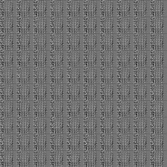
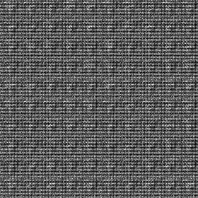

# DCRAW: Deep Convolutional Recurrent Attentive Writer

Implementation of DRAW based Auto-Encoder.
First of all, feature maps are extracted from Deep Convolutional Neural Network (DCNN).
Then, encoding and decoding are recurrently conducted by <a href="https://arxiv.org/abs/1502.04623">DRAW</a>.
Code after decoding is used to reconstruct original image.
(When the purpose is not reconstructing of original image, it is possible to set the other target image.)

## Requirements
* Python 3.5.2
* Tensorflow 1.4.0
* Numpy 1.13.3
* Scipy 1.2.0
* Matplotlib 3.0.2

## Usage
Just run the following command in the terminal.
```
$ python run.py // with default options
$ python run.py --attention True // for using attentive read and write.
$ python run.py --help // for confirming the option
```

## Architecture
<div align="center">
  
  <p>Whole architecture of the DCRAW.</p></br>
  
  <p>Architecture of the DRAW.</p>
</div>

## Results
Following figures are sequentially generated by DCRAW for each epoch.

### Without attention
<div align="center">
  <div align="center">
    
    
    
    
    </br>
    
    
    
    
    
    <p>Epoch 0.</p>
  </div>
  <div align="center">
    
    
    
    
    </br>
    
    
    
    
    
    <p>Epoch 500.</p>
  </div>
  <div align="center">
    
    
    
    
    </br>
    
    
    
    
    
    <p>Epoch 500.</p>
  </div>
</div>

### With attention
<div align="center">
  <div align="center">
    
    
    
    
    </br>
    
    
    
    
    
    <p>Epoch 0.</p>
  </div>
  <div align="center">
    
    
    
    
    </br>
    
    
    
    
    
    <p>Epoch 500.</p>
  </div>
  <div align="center">
    
    
    
    
    </br>
    
    
    
    
    
    <p>Epoch 500.</p>
  </div>
</div>

## Reference
* [DRAW: Deep Recurrent Attentive Writer](https://arxiv.org/abs/1502.04623)
* [Stacked Convolutional Auto-Encoders for Hierarchical Feature Extraction](https://link.springer.com/chapter/10.1007/978-3-642-21735-7_7)
* [An End-to-End Trainable Neural Network for Image-Based Sequence Recognition and Its Application to Scene Text Recognition](https://ieeexplore.ieee.org/abstract/document/7801919)

## Author
YeongHyeon Park
